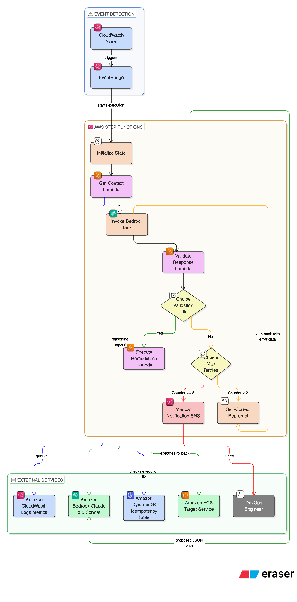

# Bedrock Incident Remediation Workflow

Production-ready AWS Step Functions workflow for remediating application latency using Amazon Bedrock, AWS Lambda, Amazon ECS, Amazon CloudWatch, Amazon SNS, and DynamoDB.



<details open>
<summary><strong>Overview</strong></summary>

This project orchestrates an automated-but-guardrailed remediation flow for ECS service latency incidents.

- AWS Step Functions coordinates the workflow
- Amazon Bedrock provides the remediation reasoning step
- Lambda functions collect context, validate model output, and execute rollback
- DynamoDB provides idempotency tracking
- SNS handles manual escalation when automation should stop

</details>

<details open>
<summary><strong>Core Components</strong></summary>

- `incident_remediation.asl.json`: State machine definition for orchestration, retries, self-correction, and escalation
- `lambdas/get_context/app.py`: Collects CloudWatch logs and metrics for the incident window
- `lambdas/validate_agent_output/app.py`: Enforces strict JSON schema validation using `jsonschema`
- `lambdas/execute_remediation/app.py`: Performs ECS rollback with execution-level idempotency
- `template.yaml`: AWS SAM deployment template
- `docs/iam-least-privilege.md`: Least-privilege IAM guidance

</details>

<details>
<summary><strong>Execution Flow</strong></summary>

1. `Initialize` sets the self-correction counter.
2. `GetContext` gathers recent CloudWatch logs and metric data for the impacted ECS service.
3. `InvokeBedrockAgent` calls Bedrock through the Step Functions optimized integration `arn:aws:states:::bedrock:invokeModel`.
4. `ValidateResponse` verifies that the model output is valid JSON and contains only approved remediation fields.
5. `SelfCorrect` re-prompts the model with the validation error if the output is malformed.
6. `ExecuteAction` performs the ECS rollback only after the response is both valid and safe.
7. `ManualInterventionNotification` publishes the incident payload to SNS when the workflow fails or proposes an unsafe action.

</details>

<details>
<summary><strong>Reliability and Safety</strong></summary>

### Idempotency

The remediation Lambda uses the Step Functions execution ID as the stable idempotency key and records progress in DynamoDB before and after the ECS update. This prevents duplicate rollback actions when retries happen around transient failures.

### Circuit Breaker

The self-correction loop is intentionally bounded to two retries. That creates a circuit-breaker pattern for malformed model output so the workflow fails closed and hands off to humans instead of retrying indefinitely.

### Deterministic Guardrails

- Only `ecs_rollback` is allowed
- Validation rejects malformed or unsupported actions
- Unsafe or exhausted flows are routed to SNS for human review

</details>

<details>
<summary><strong>Deployment</strong></summary>

Update the deployment inputs in `template.yaml` or pass them as parameters:

- Bedrock model ID
- CloudWatch log group name
- CloudWatch metric namespace and metric name
- ECS cluster name
- ECS service name
- SNS email endpoint for escalation

Build and deploy with AWS SAM:

```bash
sam build
sam deploy --guided
```

</details>

<details>
<summary><strong>Design Note About Bedrock</strong></summary>

This implementation uses the Step Functions optimized Bedrock integration:

- `arn:aws:states:::bedrock:invokeModel`

That is the native service integration modeled in the workflow. If you later decide to use a direct Amazon Bedrock Agent `InvokeAgent` API path, the clean approach is to wrap that call in a Lambda function and replace the Bedrock task while keeping the rest of the state machine unchanged.

</details>

<details>
<summary><strong>References</strong></summary>

- [Detailed design notes](readme-detailed.md)
- [Architecture diagram](docs/bedrock-incident-managemnt-workflow.png)
- [State machine definition](statemachine/incident_remediation.asl.json)
- [SAM deployment template](template.yaml)
- [IAM least-privilege guidance](docs/iam-least-privilege.md)
- [Context collection Lambda](lambdas/get_context/app.py)
- [Validation Lambda](lambdas/validate_agent_output/app.py)
- [Remediation Lambda](lambdas/execute_remediation/app.py)

</details>
